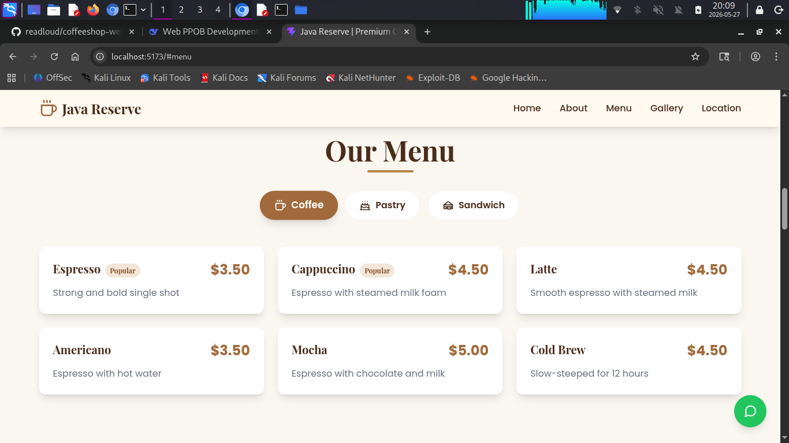

# coffeshop



### Setup Project

```bash
npm create vite@latest coffeeshop-website -- --template react
cd coffeeshop-website
npm install tailwindcss postcss autoprefixer lucide-react react-intersection-observer
npx tailwindcss init -p
```

### Development:
```bash
npm install
npm run dev
```

### Build untuk Production:
```bash
npm run build
```

### Deploy ke Vercel (Recommended):

1. Install Vercel CLI:
```bash
npm i -g vercel
```

2. Deploy:
```bash
vercel
```

Atau deploy ke Netlify:
1. Build project: `npm run build`
2. Upload folder `dist` ke Netlify

## Fitur yang Tersedia:

✅ **Responsive Design** - Mobile & desktop friendly
✅ **Modern Landing Page** - Clean & aesthetic
✅ **All Required Sections** - Hero, About, Menu, Gallery, Testimonials, Location & Contact, Footer
✅ **WhatsApp Integration** - Floating button
✅ **Smooth Animations** - Fade in, slide up, float effects
✅ **SEO Basic** - Meta tags, semantic HTML
✅ **Interactive Gallery** - Lightbox modal
✅ **Contact Form** - Ready to integrate with backend
✅ **Newsletter Subscription** - UI ready
✅ **Category Filters** - Interactive menu tabs

## Customization yang Perlu Dilakukan:

1. **Ganti gambar** - Update URL gambar di komponen sesuai dengan foto asli coffeeshop
2. **WhatsApp number** - Ubah `phoneNumber` di `WhatsAppButton.jsx`
3. **Google Maps** - Update embed URL dengan lokasi sebenarnya
4. **Contact form** - Integrasikan dengan backend API atau service seperti Formspree
5. **Social media links** - Update href dengan link sosial media asli
6. **Menu items & prices** - Sesuaikan dengan menu sebenarnya

Website ini sudah siap deploy dan fully functional. Design menggunakan tema warm & cozy dengan warna coklat dan cream yang aesthetic. Semua animasi berjalan smooth dan website fully responsive!
